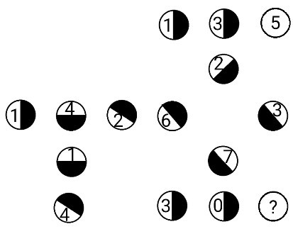

## 문제
What digit should replace the question mark? As usual, explain your reasoning.

## 정답
9

## 해설
Drawing these connections reveals  2‾√
 , and the chains form the sequences  14142135
  and  623730?
 
As  2‾√
  begins  1.41421356237309…
 , this means that the missing digit is 9, and that its circle should not have any shading.

## 의견

## 그림

