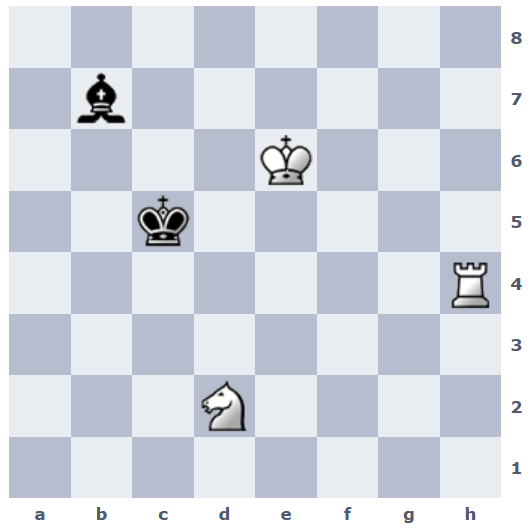

## 문제
In this position, it is white to play.

White must checkmate black in 3 moves, and both moves by black must be worstfish moves (the moves that blunder mate the quickest). If multiple moves are equally bad, black can play any of them.

FEN: 8/1b6/4K3/2k5/7R/8/3N4/8

IMPORTANT: THIS IS NOT JUST A HELPMATE

Black plays worstfish means that black plays the most that allows white to force mate the fastest, not the move that gives the fastest possible checkmate with any sequence of moves.

## 정답
1. Nc4 Kb5
2. Rh5+ Ka6
3. Ra5#

## 해설
The only 6 possible 3-move mates are these move sequences:

1) 1. Kf6  Bc6 2. Nb3+ Kd5 3. Rd4#
2) 1. Kf6  Kd5 2. Nb3  Bc6 3. Rd4#
3) 1. Nc4  Kb5 2. Rh5+ Ka6 3. Ra5#
4) 1. Rh5+ Kb6 2. Nc4+ Ka6 3. Ra5#
5) 1. Kf5  Kd5 2. Nb3  Bc6 3. Rd4#
6) 1. Kf5  Bc6 2. Nb3+ Kd5 3. Rd4#

For sequences 1 and 2, the worst move possible for black on the first move is

Bh1, which leads to mate in 11, while Bc6 and Kd5 lead to mates in 16 and 22, respectively. Therefore, (1) and (2) are not valid solutions.

For sequence 3, the worst moves for black are

Kc6 and Kb5, leading to mate in 8. After 1... Kb5 we can do Rh5+ which leaves the worst possible move to be Ka6 leading to 3. Ra5#.

For sequence 4, the worst move for black is

Bd5+ leading to mate in 8, which is worse than the required Kb6 (mate in 12), so this is not a possible option.

For sequences 5 and 6, the worst move is

Bf3 leading to mate in 10 as opposed to Kd5 (mate in 21) and Bc6 (mate in 15).

the only possible move sequence to be
1. Nc4 Kb5
2. Rh5+ Ka6
3. Ra5#

## 의견

## 그림

